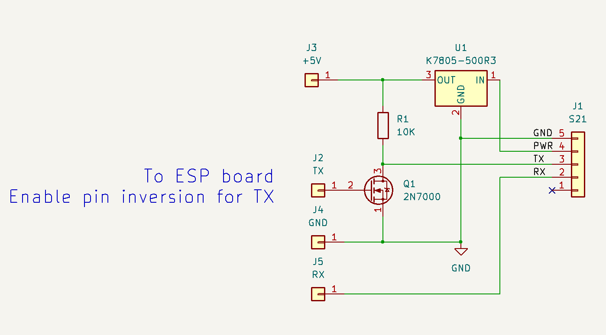
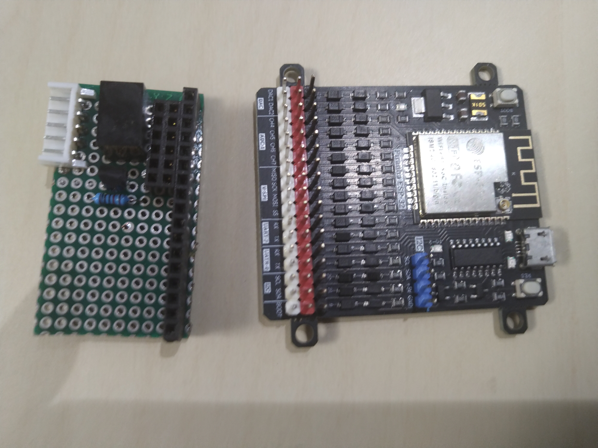
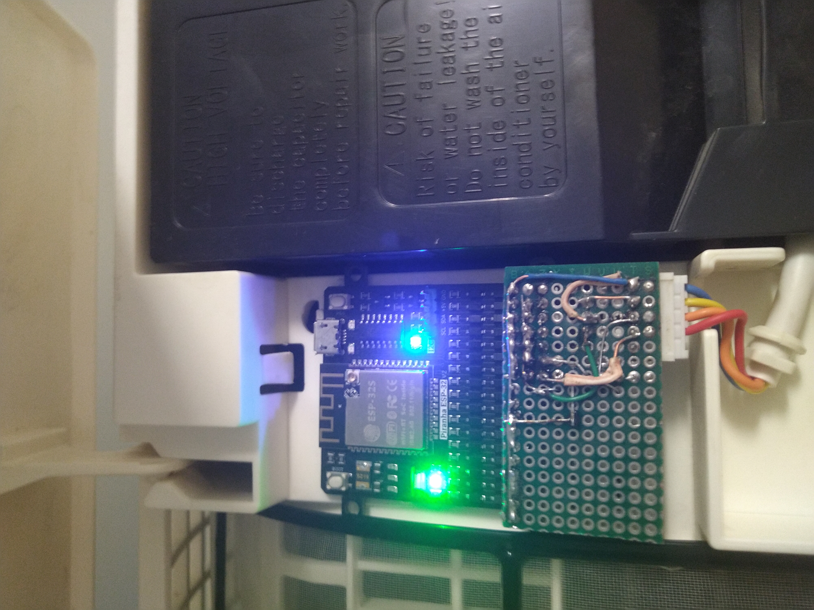

# Simple S21 adapter

I (Pavel Fedin) made and successfully used this adapter with a russian-designed ESP32-based
development board, available locally. The advantage of this schematic is a sheer simplicity
and a minimum number of parts possible. Also, this design doesn't require pull-ups on 3.3V
side, which is good for this board because authors forgot to export a 3.3V on a pin.

Yes, i have tested it with ESP32 board, but it should also run fine with 8266.

 

I only needed one such adapter, so i didn't design and order a PCB, instead built it on a perfboard.

 

The assembled controller fits nicely in original bay where BRP is supposed to sit, held in place by
double-sided sticky tape.

 

## !!! WARNING !!!

Some variations of A/C connectors, like the one marked `S403` are *non-isolated*, i.e. they at **MAINS POWER** level
relative to ground !!! Touching any running hardware, connected to such a port, **MAY KILL YOU !!!**
