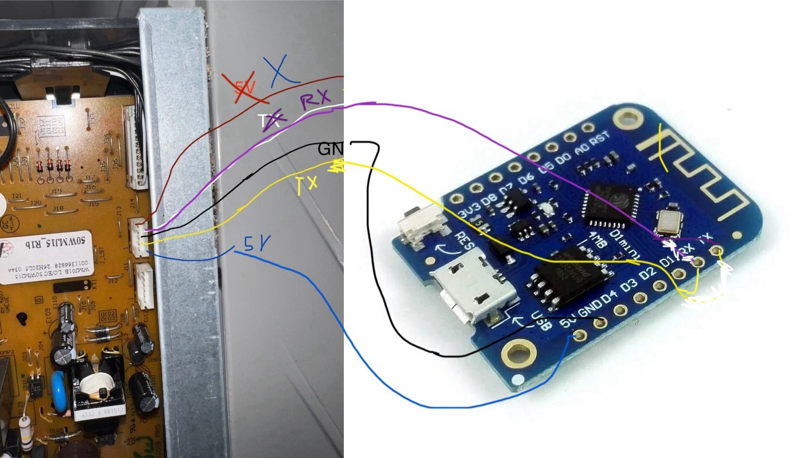
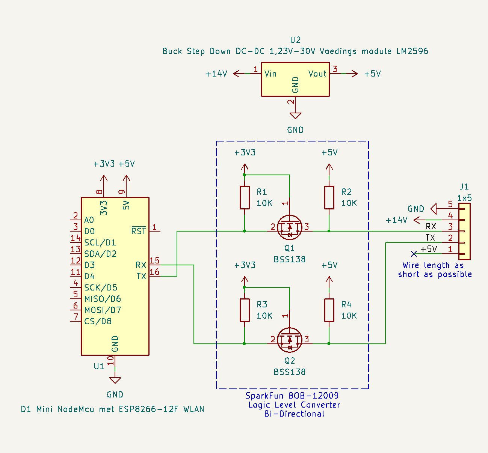

# WeMos D1-Mini

Some users are successfully running Faikin-8266 on a stock WeMos D1-Mini board, available worldwide.
ESP8266 is officially 5V-tolerant, so it can be connected to the AC directly. However different A/C
interfaces may present own quirks. It is known that S21 does not work with direct connection; and it
also appears to dislike long wires, despite being just 2400 bps. Also, 5V supply from the A/C may
appear weak, requiring using 14V power through a step-down regulator.

This picture, contributed by [ferbulous](https://github.com/ferbulous), shows direct connection to
FTN15PV1L unit with CN_WIRED interface:

 

Discussion thread: https://github.com/Sonic-Amiga/ESP8266-Faikin/issues/12

The following schematic was contributed by [Cees-tech](https://github.com/Cees-tech), who successfully
connected a D1-Mini to S21 interface using a [SparkFun BOB-12009](https://www.sparkfun.com/products/12009)
off-she-shelf level shifter and a 5V DC step-down converter:

 

Discussion thread: https://github.com/Sonic-Amiga/ESP8266-Faikin/issues/20

## !!! WARNINGS !!!
** THESE BOARDS USE 5V LOGIC**, and higher voltage (e. g. 12V) may be present on the connector !!!
Triple-check your voltages and pinouts or you risk destroying not only the board, but also possible A/C interface logic !!!

Some variations of A/C connectors, like the one marked `S403` are *non-isolated*, i.e. they at **MAINS POWER** level
relative to ground !!! Touching any running hardware, connected to such a port, **MAY KILL YOU !!!**
