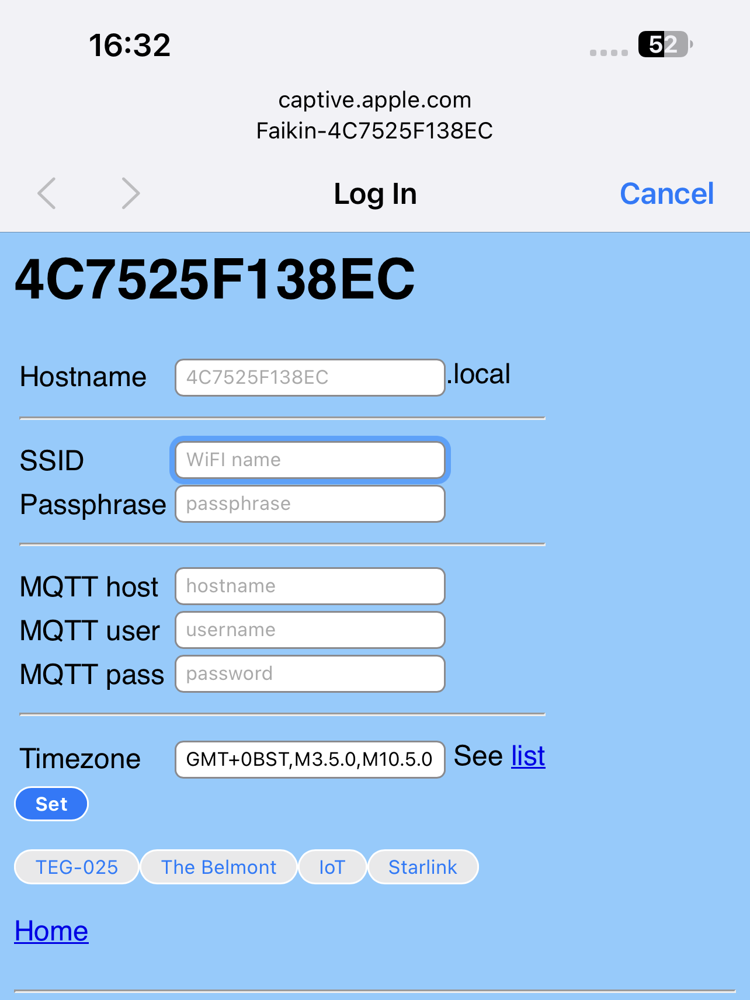

# ESP8266-Faikin

I am successfully running a great Daikin air conditioning unit in an OpenHAB-powered smart home. Recently i purchased a second one for my newly
remodeled bedroom; and was very "pleased" to see that original BRP online controller is not available for sale in my country any more due to
political reasons. There was, however, a locally developed replacement, which is, of course, not compatible with the original. Additionally it
forces me to use their proprietary cloud; not only potentially disclosing some of my privacy, but also tying my smart home to a working Internet
connection for no reason.

Fortunately i was able not only to find some information on successfully reverse engineered Daikin "S21" communication protocol, but also find
an awesome [ESP32-Faikin](https://github.com/revk/ESP32-Faikin/tree/main/main) project, which does the majority of the thing i need.

My newly purchased controller, named "Daichi" (which of course has nothing to do with the japanese company), is a small board, built around
an [AI Thinker ESP12](https://docs.ai-thinker.com/_media/esp8266/docs/esp-12f_product_specification_en.pdf) module. Therefore this project'sale
goals are:

- Backport ESP32-Faikin to ESP8266 architecture
- Support original HTTP+JSON-based BRP communication protocol, at least enough to support OpenHAB

Since various ESP8266-based hardware is widely accessible, am making this project opensource. A (partly) reverse-engineered Daichi controller
schematic is available in "Hardware" folder for those who would be interested in implementing their own board based on this or similar ESP8266
module. Since violating someone else's possible design copyrights is not the goal of this project, the schematic is incomplete. It does not
contain exact values for parts (many of these are impossible to determine without complete disassembly), it's only enough for use as a referense,
to understand how the module is interfaced and what pins are in use. There's nothing special to that really; any electronics engineer is able to
put together such a board with minimum efforts.

# Functionality

* Compatible with original BRP series Daikin online controllers; drop-in replacement
* Simple local web based control with live websocket status, easy to save as desktop icon on a mobile phone.
* MQTT reporting and controls
* Includes linux mysql/mariadb based logging and graphing tools
* Works with [EnvMon](https://github.com/revk/ESP32-EnvMon) Environmental Monitor for finer control and status display
* Automatically works out if S21 or alternative protocol used on ducted units

# Supported hardware

* Daichi DW22-B Wi-fi controller ver.03
* AnyDIY ESP8266-based board; reference schematic included.

# Conditioner compatibility list

This project is being developed and tested on FTXF20D "Sensira". There's also a list of supported
models on [Original Faikin-ESP32 wiki](https://github.com/revk/ESP32-Faikin/wiki/List-of-confirmed-working-air-con-units);
those are also expected to work.

# Set-up

Appears as access point with simple web page to set up on local WiFI

# Operation

Local interactive web control page using *hostname*.local, no app required, no external internet required.

- [Setup](Manuals/Setup.md) Manual
- [Advanced](Manuals/Advanced.md) Manual

# Building

The build requires [ESP8266 RTOS SDK v3.x](https://docs.espressif.com/projects/esp8266-rtos-sdk/en/latest/)

Git clone this `--recursive` to get all the submodules, and it should build with just `make`. There are make targets
for other variables, but this hardware is the `make pico` version. The `make` actually runs the normal `idf.py` to build with
then uses cmake. `make menuconfig` can be used to fine tune the settings, but the defaults should be mostly sane.
`make flash` should work to program. Any basic USB-to-5V-TTL-serial adapter should be fine; i used 
[WaveShare PL2303](https://www.waveshare.com/product/pl2303-usb-uart-board-type-a.htm), and of course the full ESP IDF
environment.
